# Wall Art - AI-powered custom vinyl wall graphics

Welcome to the Wall Art project! This is an e-commerce platform that allows customers to upload photos and generate personalized, AI-stylized wall art graphics (e.g., superheroes, astronauts, princesses), which are printed on high-quality vinyl and shipped.

## Architecture

```mermaid
graph TD
    Client[Web Browser] --> |HTTPS| CF[CloudFront]
    CF --> S3_SPA[S3 Static Website Hosting]
    Client --> |HTTPS| ALB[Application Load Balancer]
    ALB --> API[FastAPI Backend]
    
    API --> |Uploads/Downloads| S3_Storage[S3 Storage Private]
    API --> |Read/Write| RDS[PostgreSQL RDS]
    API --> |Task Queue| Redis[ElastiCache Redis]
    
    Redis --> Worker[Celery Workers]
    Worker --> |AI Generation| Replicate[Replicate API]
    Worker --> |Background Removal| Rembg[rembg self-hosted]
    Worker --> |Storage| S3_Storage
    Worker --> |Update Status| RDS
    
    API --> Stripe[Stripe API]
```



## Tech Stack

- **Frontend:** React 18, Vite, TypeScript, Tailwind CSS, Zustand, React Query
- **Backend:** FastAPI (Python 3.12+), SQLAlchemy (ORM), Pydantic, Celery (Task Queue)
- **Database:** PostgreSQL 16
- **Cache / Message Broker:** Redis
- **Infrastructure:** AWS (ECS Fargate, RDS, S3, CloudFront), Terraform
- **AI / ML:** Replicate API (InstantID/PhotoMaker), rembg (Background Removal)
- **Payments:** Stripe

## Prerequisites

- [Docker](https://docs.docker.com/get-docker/) & Docker Compose
- Node.js 20+
- Python 3.12+ (for local, non-docker development)

## Quick Start (Docker)

1. Clone the repository and navigate to the project root.
2. Copy the example env files:
   ```bash
   cp backend/.env.example backend/.env
   cp frontend/.env.example frontend/.env
   ```
3. Run `docker-compose`:
   ```bash
   make dev
   # or
   docker-compose up -d --build
   ```
4. Access the application:
   - Frontend SPA: http://localhost:3000
   - API Docs (Swagger): http://localhost:8000/docs

## Manual Setup (Local Development without Docker)

### Backend
1. Create a virtual environment:
   ```bash
   cd backend
   python -m venv venv
   source venv/bin/activate
   ```
2. Install dependencies:
   ```bash
   pip install -r requirements.txt
   ```
3. Start Redis and PostgreSQL (you can use Docker just for these).
4. Run migrations:
   ```bash
   alembic upgrade head
   ```
5. Start the FastAPI server:
   ```bash
   uvicorn app.main:app --reload
   ```
6. Start the Celery worker (in a new terminal):
   ```bash
   celery -A app.core.celery_app worker --loglevel=info
   ```

### Frontend
1. Install dependencies:
   ```bash
   cd frontend
   npm install
   ```
2. Start the Vite dev server:
   ```bash
   npm run dev
   ```

## Environment Variables

Refer to `backend/.env.example` and `frontend/.env.example` for required configuration variables.

## API Endpoints Overview

- `/api/themes` - Theme management
- `/api/orders` - Order management & generation workflow
- `/api/uploads` - S3 signed upload URLs
- `/api/webhooks/stripe` - Payment callbacks
- `/api/admin/*` - Admin dashboard endpoints

See [API Contract Docs](docs/api-contract.md) for full details.

## Development Workflow

- Run `make lint` to check code quality.
- Run `make test` to execute test suites.
- Commit messages should follow conventional commits.
- All PRs must pass CI (GitHub Actions).

## Testing

Backend uses `pytest`. Frontend uses `vitest` and `React Testing Library`.
Run tests via:
```bash
make test
```

## Deployment

Deployment is managed via Terraform and GitHub Actions. Pushing to `main` deploys to staging. Production deployment requires manual approval.

## Project Structure

```
d:/Office/RoyTechWorkForce/Projects/wallArt
├── .github/workflows/      # CI/CD pipelines
├── backend/                # FastAPI application
│   ├── app/                # Application code
│   ├── tests/              # Backend tests
│   └── alembic/            # Database migrations
├── frontend/               # React application
│   ├── src/                # UI code
│   └── tests/              # Frontend tests
├── docs/                   # Documentation (Architecture, APIs, ADRs)
├── infra/                  # Terraform configuration
└── docker-compose.yml      # Local development environment
```
