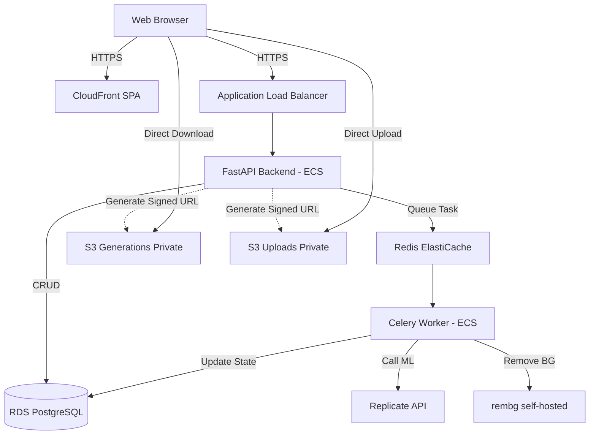

# Wall Art - Architecture Document

## System Overview

Wall Art is an e-commerce platform designed to process user-uploaded photos, generate AI-stylized artwork, and fulfill physical vinyl prints. The system relies on an asynchronous architecture to handle compute-heavy AI generation tasks seamlessly.

## Components

1. **Frontend SPA:** React-based single page application, served globally via CloudFront and S3. Contains both the customer-facing storefront/generator and the protected admin dashboard.
2. **Backend API:** FastAPI application providing REST endpoints. Handles business logic, authentication, database interaction, and task enqueuing.
3. **Celery Workers:** Asynchronous workers that process the heavy lifting: orchestrating AI API calls, running background removal, and managing high-res image compositions.
4. **PostgreSQL:** Primary relational database storing users, orders, themes, and generation metadata.
5. **Redis:** Message broker for Celery and caching layer for rate limiting and session management.
6. **S3 Storage:** Two strictly private buckets. One for raw uploads and one for generated assets. Access is brokered entirely via temporary signed URLs.

## Request Flows

### Customer Journey & Generation Pipeline
1. Customer selects a Theme.
2. Customer requests an upload URL. Backend returns an S3 presigned URL.
3. Customer uploads image directly to S3.
4. Customer submits draft order (Theme + Upload ID).
5. Backend creates Order record and enqueues generation task.
6. Worker picks up task, calls AI pipeline, updates Order state.
7. Customer polls status, retrieves preview signed URL upon completion.

### Payment Flow
1. Customer approves preview.
2. Backend generates Stripe Checkout Session.
3. Customer completes payment on Stripe.
4. Stripe Webhook hits Backend.
5. Backend verifies signature, marks Order as PAID, enqueues High-Res Production Task.

## Data Flow for Image Processing Pipeline (7 Stages)

1. **Ingestion:** Raw image validated (size/type) and fetched from S3.
2. **Face/Subject Extraction:** Detection of subject to isolate identity traits.
3. **AI Generation:** Call to Replicate (e.g., InstantID) with theme prompt and subject image.
4. **Background Removal:** Raw generation is passed through `rembg` to strip AI-generated backgrounds, leaving only the subject.
5. **Upscaling:** The isolated subject is upscaled using Real-ESRGAN (via Replicate or Pillow fallback if sufficient).
6. **Composition:** Subject is composited onto a transparent canvas (or specific background) at exact print dimensions.
7. **Export & Storage:** Final file saved to Generations S3 bucket.

## Security Architecture

- **S3 Access:** All buckets have `BlockPublicAccess=True`. No public URLs exist. The frontend requests short-lived (15 min) signed URLs for all uploads and downloads.
- **Admin Auth:** JWT-based authentication for all `/api/admin/*` routes.
- **Webhook Verification:** Stripe webhooks strictly validated using secret signatures.
- **Data Privacy:** Customer uploads (potentially containing minors) are isolated. Soft-deletion and right-to-erasure workflows are supported.

## AI Pipeline Architecture

- **Primary Engine:** Replicate API utilizing identity-preserving models (InstantID, PhotoMaker, or IP-Adapter FaceID).
- **Background Removal:** `rembg` (BiRefNet or U2Net) running locally within the Celery worker to avoid external API latency/costs.
- **Upscaling:** Real-ESRGAN via Replicate. Pillow fallback for simple resizing if necessary.
- **Production Format:**
  - Target DPI: 150-300 DPI (Must be confirmed with the specific print vendor before finalizing dimensions).
  - Preview Format: sRGB JPEG/WebP.
  - Production Format: Transparent PNG (or TIFF). Note: CMYK conversion may be required by the print vendor; currently stored as high-res RGB.

## Storage Architecture

- `uploads-bucket`: Raw customer photos. Strict retention policy (e.g., delete after 30 days or post-generation).
- `generations-bucket`: Output artwork.
- Access strictly via AWS IAM Roles for ECS tasks, and presigned URLs for clients.

## Deployment Architecture

- **Compute:** AWS ECS Fargate (Serverless containers). Separate services for API and Workers.
- **Database:** Amazon RDS for PostgreSQL.
- **Cache:** Amazon ElastiCache (Redis).
- **Storage:** Amazon S3.
- **CDN:** Amazon CloudFront.
- **DNS:** Amazon Route 53.
